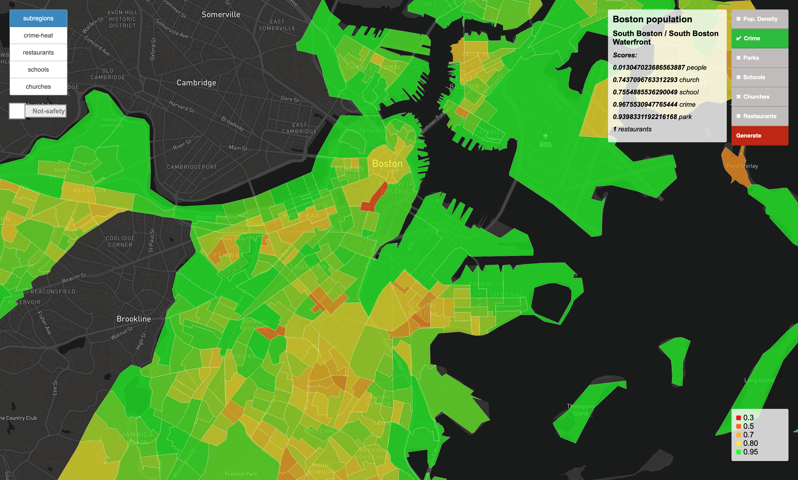
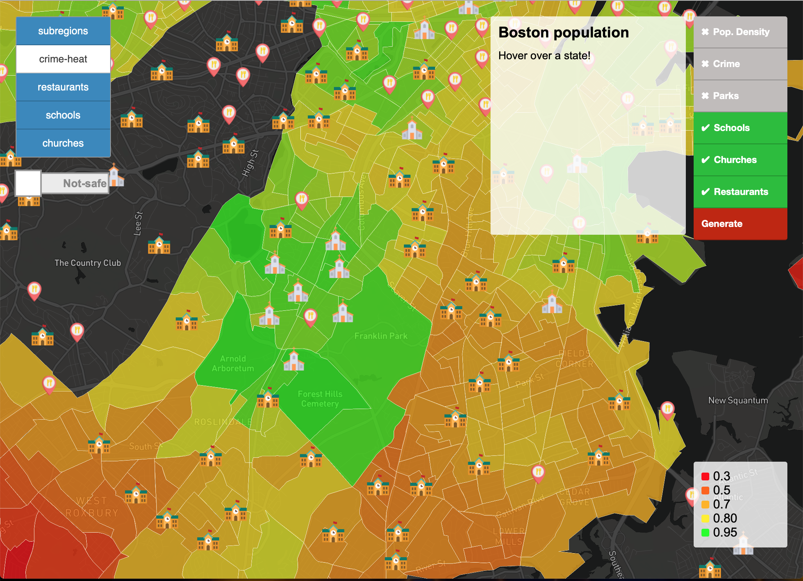
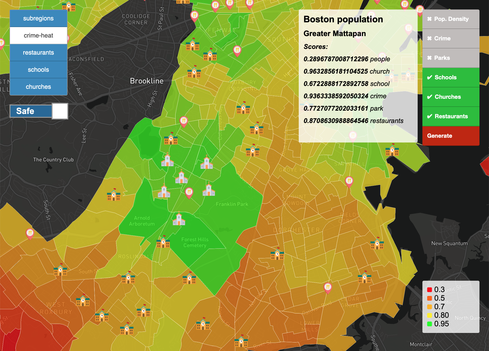

# Visualization of Living suitability

The application is a map-based application that allows users to find a place for ideal living in Boston. 
The users can choose preferences such as nearness of schools, restaurants or population density to find an ideal place for living. 
The application also provides visualisation of restaurants, schools and churches in Boston.

## Views

### Heat-map of the regions

Main view of the application is heat-map of the Boston's regions generated by user preferences.
In the menu on the right you can choose what you prefer for your living:
- population density (negative)
- crime (negative)
- parks
- schools
- churches
- restaurants

After you choose the preferences and click on the button "Generate", 
the application creates heat-map of the regions with the final score. 
You can see the elements of the partial score when you hover over the region.

The areas of Boston's regions were downloaded from https://worldmap.harvard.edu/data/geonode:blockgroupsbyregion.

### Places 

In the application on the left menu you can choose to show different types of places on the map (schools, restaurants and churches). 
The left menu also provides a switch for showing only places in safe areas.
Positions of the places was downloaded from https://www.openstreetmap.org.

Showing all places | Showing places only in safe areas
:----------:|:----------:
  |  

### Crime heat-map

The crime rate of the regions is an important aspect for living of your dreams. 
The application provides heat-map of the places where crime was confirmed. 
We choose to look at these types of crimes:
  - Vandalism
  - Violations
  - Simple Assault
  - Larceny From Motor Vehicle
  - Larceny
  - Drug Violation
  - Auto Theft
  - Aggravated Assault
  

Data of crime victims was downloaded from https://www.kaggle.com/ankkur13/boston-crime-data.

## Built With

* [Django](https://docs.djangoproject.com/en/2.1/) - The web framework
* [Mapbox GL JS](https://docs.mapbox.com/help/glossary/mapbox-gl-js/) -  Used to render interactive map
* [PostgreSQL](https://www.postgresql.org/docs/) - Object-relational database system

The application was created as a school project for subject Advanced Database Technologies.